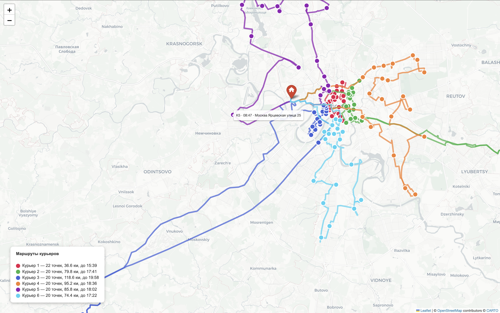

# 🚚 Moscow Delivery Router

Система автоматической оптимизации маршрутов развозки по Москве на основе реальных дорог, геокодинга и алгоритмов маршрутизации.

---

## Оглавление

1. [Зачем это нужно](#зачем-это-нужно)
2. [Выгода](#выгода)
3. [Как это работает — общая схема](#как-это-работает--общая-схема)
4. [Установка](#установка)
5. [Быстрый старт](#быстрый-старт)
6. [Параметры](#параметры)
7. [Разбор кода по блокам](#разбор-кода-по-блокам)
   - [Блок 1. Импорты и зависимости](#блок-1-импорты-и-зависимости)
   - [Блок 2. Параметры задачи](#блок-2-параметры-задачи)
   - [Блок 3. Чтение CSV и геокодинг](#блок-3-чтение-csv-и-геокодинг)
   - [Блок 4. Загрузка графа дорог](#блок-4-загрузка-графа-дорог)
   - [Блок 5. Привязка к графу и дедупликация](#блок-5-привязка-к-графу-и-дедупликация)
   - [Блок 6. Матрица расстояний и времени](#блок-6-матрица-расстояний-и-времени)
   - [Блок 7. OR-Tools VRP — оптимизация маршрутов](#блок-7-or-tools-vrp--оптимизация-маршрутов)
   - [Блок 8. Извлечение маршрутов](#блок-8-извлечение-маршрутов)
   - [Блок 9. Отчёт и путевые листы](#блок-9-отчёт-и-путевые-листы)
   - [Блок 10. Интерактивная карта](#блок-10-интерактивная-карта)
8. [Формат входных данных](#формат-входных-данных)
9. [Формат выходных данных](#формат-выходных-данных)

---

## Зачем это нужно

Когда у вас 10 курьеров и 120 точек доставки — вопрос «кто куда едет» на первый взгляд кажется простым. На практике это NP-сложная задача: количество возможных комбинаций маршрутов астрономически велико, и найти оптимальный вручную невозможно.

Типичная ситуация без автоматизации:
- Диспетчер распределяет адреса «на глаз» по районам
- Один курьер едет 90 км и заканчивает в 19:00, другой делает 30 км и возвращается в 13:00
- Маршруты пересекаются — курьеры проезжают мимо чужих точек
- Никакой гарантии что все уложатся в смену

Этот скрипт решает задачу математически — за 1–2 минуты строит маршруты по реальным дорогам Москвы с гарантией что каждый курьер уложится в 11-часовую смену.

---

## Выгода

| Метрика | Без оптимизации | С оптимизацией |
|---|---|---|
| Время планирования | 30–60 мин диспетчера | ~3 мин (запуск скрипта) |
| Разброс нагрузки | 2–3× между курьерами | ≤ 10% между курьерами |
| Пересечение маршрутов | Постоянно | Минимально (зонирование) |
| Риск не уложиться в смену | Высокий | Контролируемый |
| Путевой лист | Формируется вручную | Генерируется автоматически |
| Визуализация | Нет | Интерактивная карта с маршрутами |

**Конкретный экономический эффект** — при средней скорости 17 км/ч экономия 15–20 км на курьера в день даёт ~1 час рабочего времени. На 10 курьерах это 10 часов ежедневно, или полторы ставки которые можно не нанимать.

---

## Как это работает — общая схема

```
deliveries_input.csv
       │
       ▼
  Геокодинг (Nominatim)
  адрес → координаты
       │
       ▼
  Граф дорог Москвы (OSMnx)
  координаты → узлы дорожной сети
       │
       ▼
  Матрица времени N×N
  реальное время между всеми парами точек (алгоритм Дейкстры)
       │
       ▼
  OR-Tools VRP
  оптимальное распределение точек по курьерам
  с соблюдением ограничения по смене
       │
       ├──► Путевые листы (консоль)
       ├──► Сводная таблица (консоль)
       └──► moscow_delivery.html (интерактивная карта)
```

---

## Установка

```bash
pip install ortools osmnx networkx geopy folium pandas numpy scikit-learn
```

Граф Москвы скачивается один раз и сохраняется локально:

```python
import osmnx as ox
G = ox.graph_from_place("Moscow, Russia", network_type="drive")
ox.save_graphml(G, "graph/moscow.graphml")
```

---

## Быстрый старт

1. Подготовьте `deliveries_input.csv` — список адресов без запятых:
```
address
Москва ул. Тверская 1
Москва Проспект Мира 20
Москва Кутузовский проспект 15
```

2. Настройте параметры в начале скрипта (склад, количество курьеров и т.д.)

3. Запустите:
```bash
python vehicle_routing.py
```

4. Откройте `result/moscow_delivery.html` в браузере

---

## Параметры

| Параметр | Значение по умолчанию | Описание |
|---|---|---|
| `INPUT_CSV` | `deliveries_input.csv` | Файл с адресами доставки |
| `DEPOT_COORDS` | `(55.759660, 37.531388)` | Координаты склада (широта, долгота) |
| `DEPOT_ADDRESS` | `Склад Ермакова Роща` | Название склада для путевого листа |
| `N_COURIERS` | `6` | Количество курьеров |
| `WORK_START` | `8 * 3600` | Начало смены (08:00 в секундах) |
| `WORK_END` | `19 * 3600` | Конец смены (19:00 в секундах) |
| `AVG_SPEED_MS` | `17 км/ч` | Средняя скорость с учётом пробок |
| `STOP_TIME` | `15 * 60` | Время на одну доставку (15 мин) |
| `GRAPHML_PATH` | `graph/moscow.graphml` | Путь к файлу графа дорог |

---

## Разбор кода по блокам

### Блок 1. Импорты и зависимости

```python
from ortools.constraint_solver import routing_enums_pb2
from ortools.constraint_solver import pywrapcp
```
**Google OR-Tools** — промышленная библиотека комбинаторной оптимизации от Google. Решает Vehicle Routing Problem (VRP) — задачу о нескольких коммивояжёрах с ограничениями. `pywrapcp` — основной движок, `routing_enums_pb2` — константы для выбора алгоритма поиска.

```python
from geopy.geocoders import Nominatim
from geopy.extra.rate_limiter import RateLimiter
```
**Nominatim** — геокодер OpenStreetMap, бесплатно переводит текстовые адреса в координаты. `RateLimiter` — обёртка, которая автоматически делает паузы между запросами чтобы не получить бан от сервера (Nominatim ограничивает: 1 запрос в секунду).

```python
import osmnx as ox
import networkx as nx
```
**OSMnx** загружает и работает с дорожными графами OpenStreetMap. **NetworkX** — библиотека для работы с графами: ищет кратчайшие пути между узлами (алгоритм Дейкстры), находит связные компоненты.

```python
import folium
```
Строит интерактивные HTML-карты на основе Leaflet.js. Результат — самодостаточный HTML-файл, открывается в любом браузере без интернета и серверов.

---

### Блок 2. Параметры задачи

```python
WORK_START = 8  * 3600   # = 28800
WORK_END   = 19 * 3600   # = 68400
MAX_SHIFT  = WORK_END - WORK_START  # = 39600 секунд = 11 часов
```
Всё время хранится в **секундах от полуночи** — OR-Tools работает исключительно с целыми числами, не с объектами `datetime`.

```python
AVG_SPEED_MS = 17 * 1000 / 3600  # ≈ 4.72 м/с
```
17 км/ч конвертируем в метры в секунду, потому что расстояния в дорожном графе хранятся в метрах. Это средняя скорость по Москве с учётом пробок, светофоров и парковки.

```python
STOP_TIME = 15 * 60  # = 900 секунд
```
Время на каждую доставку — от парковки до возврата в машину. Учитывается при расчёте финального времени курьера.

---

### Блок 3. Чтение CSV и геокодинг

```python
df = pd.read_csv(INPUT_CSV, encoding='utf-8-sig', header=None, names=['address'], skiprows=1)
```
`utf-8-sig` убирает BOM-метку (невидимый символ в начале файла который иногда добавляют Excel и Numbers). `header=None` + `names=['address']` + `skiprows=1` — берём первую колонку как адрес независимо от названия заголовка, это защита от ситуации когда pandas неправильно парсит заголовок из-за BOM.

```python
need_geo = df[df['lat'].isna() | df['lon'].isna()]
```
Фильтруем только те строки которым нужен геокодинг. Если в CSV уже есть колонки `lat` и `lon` — они пропускаются, геокодинг не тратит время на уже известные координаты.

```python
geolocator = Nominatim(user_agent="moscow_vrp_v2", timeout=10)
geocode    = RateLimiter(geolocator.geocode, min_delay_seconds=1.0, max_retries=3, error_wait_seconds=5.0)
```
`user_agent` — обязательная строка-идентификатор, Nominatim блокирует запросы без неё. `timeout=10` — ждём ответа 10 секунд (дефолт 1 секунда — слишком мало для медленного соединения). `max_retries=3` — при таймауте автоматически повторяет запрос трижды с паузой 5 секунд.

```python
query = addr if 'москва' in addr.lower() else f"Москва, {addr}"
```
Если в адресе нет слова «Москва» — дописываем спереди, иначе Nominatim может найти улицу в другом городе.

---

### Блок 4. Загрузка графа дорог

```python
G = ox.load_graphml(GRAPHML_PATH)
```
Загружает заранее сохранённый граф дорожной сети Москвы. Граф — это математическая структура: **узлы** (перекрёстки и точки на дорогах) + **рёбра** (отрезки дорог с атрибутом длины в метрах). В графе Москвы ~500 000 узлов и ~1 200 000 рёбер.

```python
G = G.subgraph(max(nx.strongly_connected_components(G), key=len)).copy()
```
Это критически важная строка для корректности карты. Дорожный граф Москвы **несвязный** — в нём есть изолированные куски: тупиковые дворы, промзоны, отдельные парковки. Если точка попала в такой изолированный кусок — путь к ней не существует и скрипт нарисует прямую линию по воздуху.

`strongly_connected_components` находит все группы узлов, внутри которых из каждого узла можно добраться до любого другого. Берём самую большую такую группу — это основная дорожная сеть. Обычно это 95–98% всех узлов.

---

### Блок 5. Привязка к графу и дедупликация

```python
depot_node = ox.distance.nearest_nodes(G, DEPOT_COORDS[1], DEPOT_COORDS[0])
```
Находим узел графа ближайший к складу. Важен порядок аргументов — OSMnx принимает сначала **долготу (lon)**, потом **широту (lat)**, а не наоборот как можно ожидать.

```python
df['node'] = ox.distance.nearest_nodes(G, df['lon'].tolist(), df['lat'].tolist())
```
То же самое для всех точек доставки батчем — каждому адресу находим ближайший узел дорожного графа. После этого координаты больше не используются — вся математика работает с узлами графа.

```python
df = df[df['node'] != depot_node]
df = df.drop_duplicates(subset='node').reset_index(drop=True)
```
Два адреса в одном квартале могут «привязаться» к одному узлу графа. Оставляем только уникальные узлы — дубли привели бы к тому что курьер дважды приезжал бы в одно место.

```python
all_nodes = [depot_node] + df['node'].tolist()
```
Главный список задачи. Индекс `0` — всегда склад, индексы `1, 2, ..., N` — точки доставки. Этот порядок используется как ключ во всех матрицах и извлечении маршрутов.

---

### Блок 6. Матрица расстояний и времени

Самый долгий блок — занимает 2–3 минуты. Строим квадратную матрицу N×N где каждая ячейка [i][j] — время езды от точки i до точки j по реальным дорогам.

```python
lengths = dict(nx.single_source_dijkstra_path_length(G, all_nodes[i], weight='length'))
```
Алгоритм Дейкстры — за один запуск находит кратчайшие расстояния от узла `i` до **всех остальных** узлов графа. Это гораздо эффективнее чем запускать поиск для каждой пары отдельно.

```python
drive_sec = int(d / AVG_SPEED_MS)
time_matrix[i][j] = min(drive_sec + (STOP_TIME if j != 0 else 0), MAX_SHIFT)
```
Переводим метры во время. К каждому переезду добавляем 15 минут остановки — кроме возврата на склад (индекс 0), там останавливаться не нужно. Результат не может превышать длину смены.

**Почему матрица, а не поиск пути на лету?** OR-Tools вызывает функцию стоимости миллионы раз в процессе оптимизации. Каждый поиск пути по графу занял бы миллисекунды — итого часы. Предварительно посчитанная матрица даёт мгновенный ответ за O(1).

---

### Блок 7. OR-Tools VRP — оптимизация маршрутов

```python
manager = pywrapcp.RoutingIndexManager(N, N_COURIERS, 0)
routing = pywrapcp.RoutingModel(manager)
```
OR-Tools использует собственную систему индексов отличную от нашей. `RoutingIndexManager` — переводчик между ними. Аргументы: количество узлов, количество курьеров, индекс склада.

```python
def time_callback(from_idx, to_idx):
    return data['time_matrix'][manager.IndexToNode(from_idx)][manager.IndexToNode(to_idx)]

transit_cb = routing.RegisterTransitCallback(time_callback)
routing.SetArcCostEvaluatorOfAllVehicles(transit_cb)
```
OR-Tools не работает с матрицей напрямую — он запрашивает стоимость перехода через callback-функцию. `SetArcCostEvaluatorOfAllVehicles` говорит движку: «минимизируй сумму этих значений» — то есть минимизируй суммарное время всех курьеров.

```python
routing.AddDimension(transit_cb, 0, MAX_SHIFT, True, 'Time')
```
Добавляет «измерение времени» — жёсткое ограничение: накопленное время каждого курьера не превышает 39 600 секунд (11 часов). Без этого OR-Tools мог бы назначить одному курьеру бесконечно много точек.

```python
search_params.first_solution_strategy = PATH_CHEAPEST_ARC
```
Стратегия построения начального решения — жадный алгоритм: каждый шаг добавляет самое «дешёвое» ребро. Быстро даёт первое допустимое решение.

```python
search_params.local_search_metaheuristic = GUIDED_LOCAL_SEARCH
search_params.time_limit.seconds = 45
```
После начального решения включается улучшение. GLS (Guided Local Search) итеративно переставляет точки между маршрутами, добавляет штрафы за часто используемые рёбра чтобы алгоритм не застревал в локальных минимумах. 45 секунд — по истечении возвращает лучшее найденное.

---

### Блок 8. Извлечение маршрутов

```python
index = routing.Start(vid)
while not routing.IsEnd(index):
    route_idx.append(manager.IndexToNode(index))
    index = solution.Value(routing.NextVar(index))
```
Проходим по решению OR-Tools как по связному списку. `NextVar` даёт следующий узел маршрута. Собираем последовательность индексов в порядке объезда.

```python
path   = nx.shortest_path(G, u, v, weight='length')
coords = [(G.nodes[n]['y'], G.nodes[n]['x']) for n in path]
segments.append(coords)
```
OR-Tools знает **порядок** точек, но не знает конкретный путь между ними — он работал с матрицей, а не с графом. Здесь мы берём каждую пару соседних точек маршрута и находим реальный путь по дорогам. Собираем координаты всех промежуточных узлов — это то, что рисуется на карте как линия.

```python
t += time_matrix[prev_idx][si]
arrival_times.append(f"{int(t//3600):02d}:{int((t%3600)//60):02d}")
```
Накапливаем время с 08:00 и переводим секунды в формат `ЧЧ:ММ` для путевого листа.

---

### Блок 9. Отчёт и путевые листы

```python
stats_df = pd.DataFrame(courier_stats).set_index('Курьер')
print(stats_df.to_string())
```
Сводная таблица по всем курьерам: количество точек, пробег, время в пути, время стоянок, общее время, время финиша, укладывается ли в смену.

Путевой лист для каждого курьера — упорядоченный список адресов с временем прибытия, готовый к распечатке или отправке.

---

### Блок 10. Интерактивная карта

```python
m = folium.Map(location=DEPOT_COORDS, zoom_start=11, tiles='cartodbpositron')
```
Создаём карту центрированную на складе. `cartodbpositron` — светлая минималистичная тема, на ней хорошо видны цветные маршруты.

```python
folium.PolyLine(seg, color=color, weight=4, opacity=0.75, tooltip=...)
```
Рисует линию маршрута по координатам сегмента. Каждый курьер — свой цвет. `tooltip` — информация при наведении мыши.

```python
folium.CircleMarker(coord, radius=7, fill_color=color, popup=...)
```
Цветной кружок на каждой точке доставки. В `popup` при клике — адрес и время прибытия.

```python
m.get_root().html.add_child(folium.Element(legend_html))
m.save('result/moscow_delivery.html')
```
Легенда со списком курьеров вставляется как HTML поверх карты. Финальный файл — самодостаточный HTML, открывается без интернета и серверов.

---

## Формат входных данных

Файл `deliveries_input.csv` — один адрес в строку, **без запятых** внутри адреса:

```
address
Москва ул. Тверская 1
Москва Проспект Мира 20
Москва Кутузовский проспект 15
```

Если координаты уже известны — можно добавить колонки `lat` и `lon`, геокодинг пропустится:

```
address,lat,lon
Москва ул. Тверская 1,55.764750,37.606078
Москва Проспект Мира 20,55.770500,37.630200
```

---

## Формат выходных данных

**Консоль** — сводная таблица и путевые листы:
```
Курьер  Доставок  Пробег, км  В пути, ч  Стоянки, ч  Итого, ч  Финиш  В смену
1           21        67.3        4.0         5.3         9.3   17:17    ✅
2           20        71.1        4.2         5.0         9.2   17:12    ✅
...

Курьер 1  |  21 точек  |  67.3 км  |  финиш 17:17
  Старт: Склад в 08:00
   1. 08:24  Москва ул. Тверская 1
   2. 08:51  Москва Проспект Мира 20
  ...
  Возврат на склад
```


— интерактивная карта с маршрутами, точками доставки и легендой. Каждый курьер — свой цвет. Клик по точке — адрес и время прибытия. Наведение на линию — суммарная статистика курьера.
